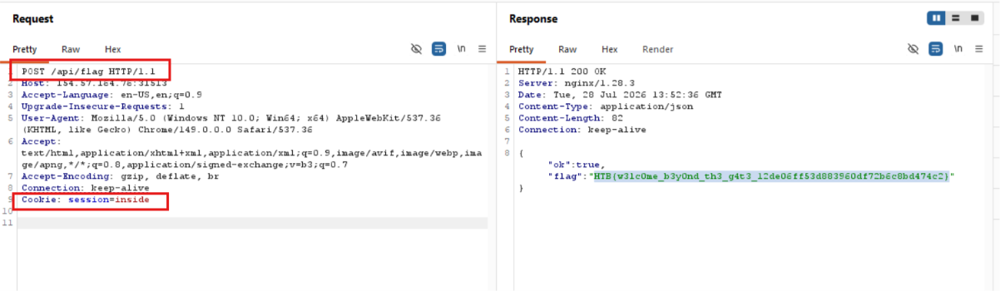

# Gatery

Trong file `index.ts` có một điểm đáng chú ý là

```Python
.post('/api/flag', ({ cookie: { session }, set }) => {
    if (!session.value) {
      set.status = 401
      return { ok: false, message: 'Login required' }
    }

    if (session.value !== 'inside') {
      set.status = 403
      return { ok: false, message: 'Enter the castle first' }
    }

    return { ok: true, flag }
  })
```

Đoạn này nói rằng nếu session có giá trị là `inside` thì sẽ trả flag


