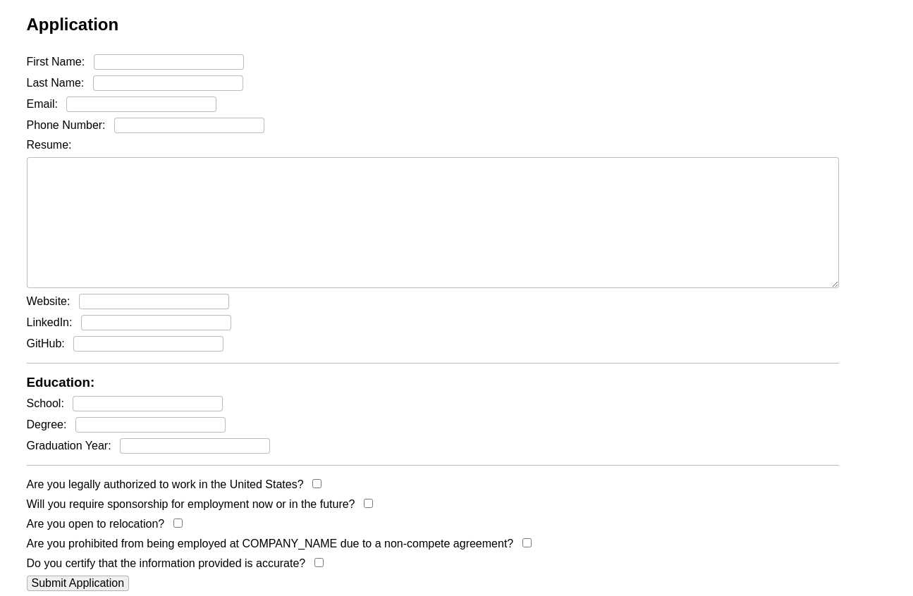
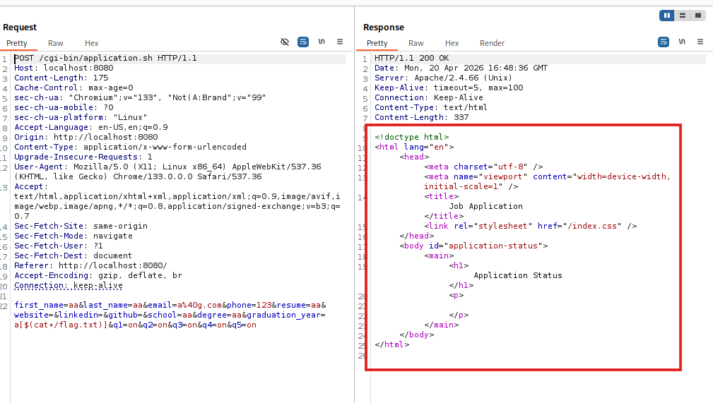
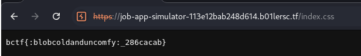

# b01lers CTF
> Lê Hữu Hoàng - 24520539 - ATTN2024
---

### job-app-simulator

#### Tổng quan:


Đề cho 1 trang web để nộp đơn xin việc, với file `application.sh` dùng để xử lý dữ liệu POST.

#### Phân tích:

```python
if [[ "$REQUEST_METHOD" != "POST" ]]; then
	echo "Status: 405 Method Not Allowed"
	echo "Allow: POST"
	echo
	echo "<html><body><h1>Method Not Allowed</h1></body></html>"
	exit 1
fi

if ! [[ "$CONTENT_TYPE" == application/x-www-form-urlencoded* ]]; then
	echo "Status: 400 Bad Request"
	echo
	echo "<html><body><h1>Bad Request</h1></body></html>"
	exit 1
fi

if [[ "$CONTENT_LENGTH" -ge 1000000 ]]; then
	echo "Status: 413 Payload Too Large"
	echo
	echo "<html><body><h1>Payload Too Large</h1></body></html>"
	exit 1
fi
```
Những lệnh `if` trên dùng để kiểm soát method, content_type và content_length.

Ngoài ra, khi mình post dữ liệu lên, chúng sẽ được đọc và chuyển sang mảng `form_data`:
```python
IFS= read -r -n "$CONTENT_LENGTH" request_body
declare -A form_data   
while IFS='=' read -r -d '&' key value && [[ -n "$key" ]]; do
    form_data["$(urldecode "$key")"]="$(urldecode "$value")"
done <<<"$request_body&"
```

Hàm quan trọng nhất ở đây là hàm `generate_content()`:

```python
function generate_content() {
	required_keys=(first_name last_name email phone resume school degree graduation_year q1 q2 q3 q4 q5)

	for key in "${required_keys[@]}"; do
		if [[ -z "${form_data[$key]}" ]]; then
			echo "Missing required field '$key'"
			return
		fi
	done

	if ! [[ "${form_data[email]}" =~ ^[a-zA-Z0-9_.+\-]+@[a-zA-Z0-9\-]+\.[a-zA-Z0-9\-]+$ ]]; then
		echo "Invalid email address"
		return
	fi

	if ! [[ "${form_data[phone]}" =~ ^\+?[0-9\s-]+$ ]]; then
		echo "Invalid phone number"
		return
	fi

	if [[ -n "${form_data[linkedin]}" ]] && ! [[ "${form_data[linkedin]}" =~ ^https?://(www\.)?linkedin\.com/in/[a-zA-Z0-9-]+/?$ ]]; then
		echo "Invalid LinkedIn URL"
		return
	fi

	if [[ -n "${form_data[github]}" ]] && ! [[ "${form_data[github]}" =~ ^https?://(www\.)?github\.com/[a-zA-Z0-9-]+/?$ ]]; then
		echo "Invalid GitHub URL"
		return
	fi

	if [[ -n "${form_data[website]}" ]] && ! [[ "${form_data[website]}" =~ ^https?://.*$ ]]; then
		echo "Invalid website URL"
		return
	fi

	if [[ "${form_data[graduation_year]}" -lt 2026 ]]; then
		echo "Invalid graduation year"
		return
	fi

	cat <<EOF

Thank you so much for your interest in COMPANY_NAME. We know that it takes time and energy to submit for a new role. 
Our recruiting team carefully reviewed your background and experience and, unfortunately, we won't be moving forward with your application at this time. <br><br>

We do encourage you to keep an eye for roles that may be a better match in the future. Thank you again for taking the time to apply!
EOF
}
```

Hàm thực hiện kiểm tra các trường `first_name last_name email phone resume school degree graduation_year q1 q2 q3 q4 q5`. Nhưng mà trường `graduation_year` thiếu an toàn nghiêm trọng. 


```python
if [[ "${form_data[graduation_year]}" -lt 2026 ]]; then
		echo "Invalid graduation year"
		return
	fi
```

Cụ thể, nó chỉ kiểm tra xem giá trị có lớn hơn hoặc bằng 2026 hay không, chứ không kiểm tra giá trị nhập vào phải là các chữ số trước. 

Do đó, nếu giá trị của `form_data[graduation_year]` có dạng biến gọi mảng `a[<biểu_thức_con>]`, Bash sẽ tiếp tục lấy `<biểu_thức_con>` ra để tính toán.

Từ đó, mình có suy nghĩ là sẽ chèn `$(command)` vào `<biểu_thức_con>` để lấy flag.

#### Khai thác:
Đầu tiên, mình lấy payload là `a[$(cat /flag.txt)]`



Nhưng kết quả trả về không có gì, bởi lẽ nó đã bị hấp thụ ngược vào hàm `$(generate_content)`. 

Do đó, nếu không in thẳng ra được, thì ta có thể thử in vào file `index.css`. Trong `Dockerfile`
nói file này nằm ở `/usr/local/apache2/htdocs/`
```dockerfile
COPY --chown=www-data index.html index.css /usr/local/apache2/htdocs/
```

Payload tiếp theo:

    a[$(cat /flag.txt > /usr/local/apache2/htdocs/)]

Trình duyệt vẫn sẽ trả về `Invalid graduation year` nhưng khi vào `/index.css` thì ta có flag




