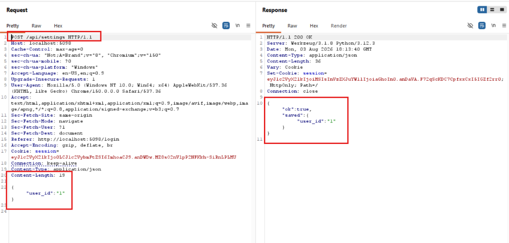
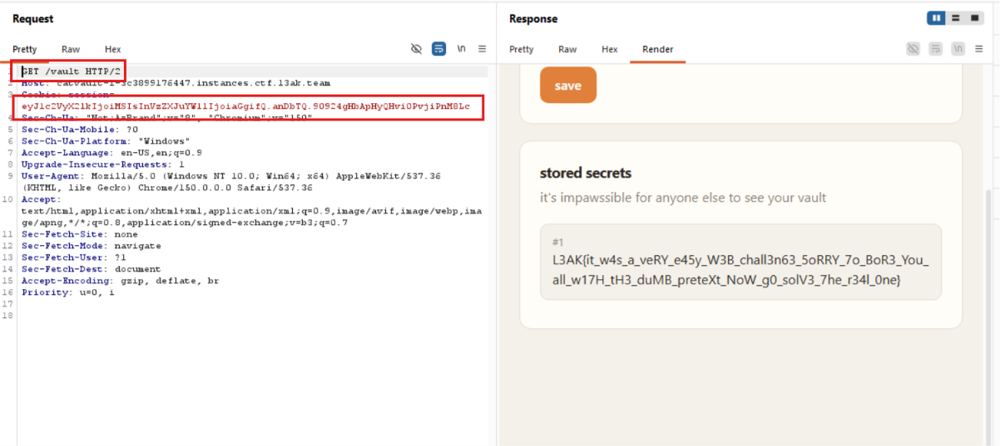

# CatVault

## Overview

Bài này chứa flag nằm trong vault của admin

```Python
def create_admin():
    connect()
    cursor.execute("INSERT INTO users (name, password) VALUES ('admin', 'nologin');")
    conn.commit()
    cursor.execute(f"INSERT INTO vault (user_id, content) VALUES ({cursor.lastrowid}, '{FLAG}');")
    conn.commit()
```

Bug bài này nằm ở endpoint `/api/settings`, user có thể điền các key vào session:

```Python
for key, value in incoming.items():
        if not isinstance(key, str) or key.startswith("_") or not isinstance(value, str):
            continue
        session[key] = value
        saved[key] = value
```

Vậy ta có thể lợi dụng điều này để biến user_id của ta thành của admin, sau đó đọc flag

## Solution

Thay đổi "user_id":

	

Sau đó, vào vault với session mới



> FLAG: L3AK{it_w4s_a_veRY_e45y_W3B_chall3n63_5oRRY_7o_BoR3_You_all_w17H_tH3_duMB_preteXt_NoW_g0_solV3_7he_r34l_0ne}
